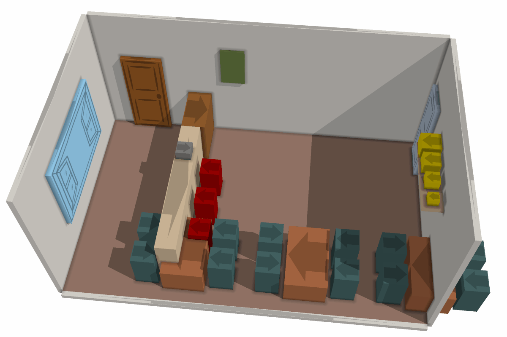
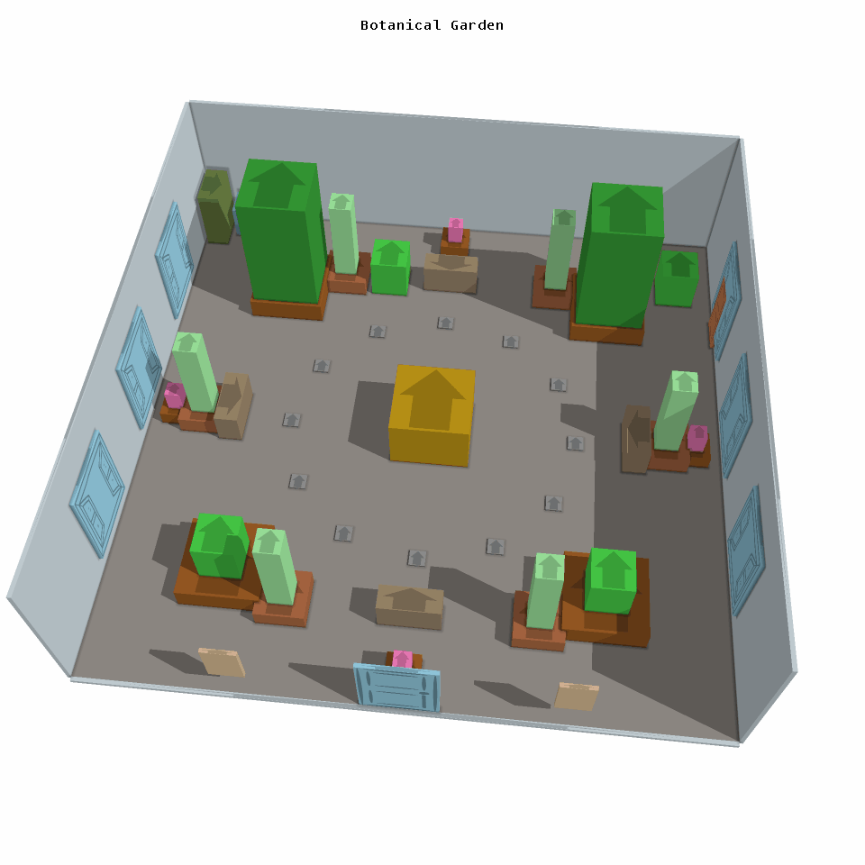
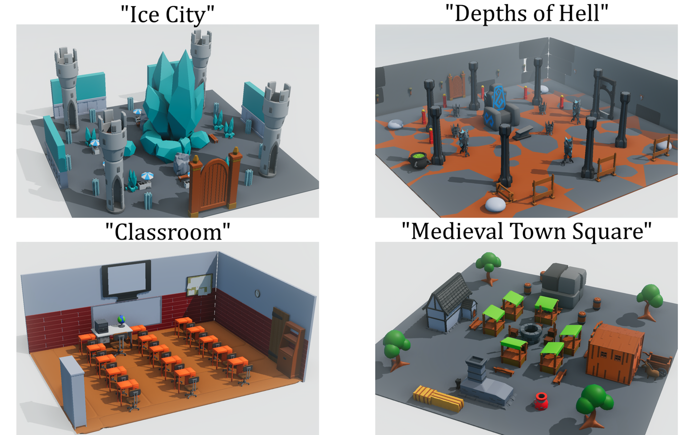
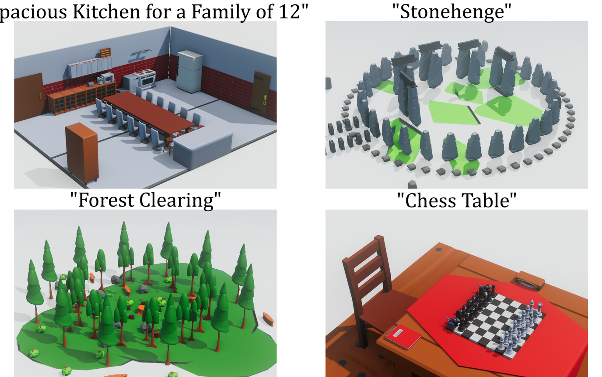
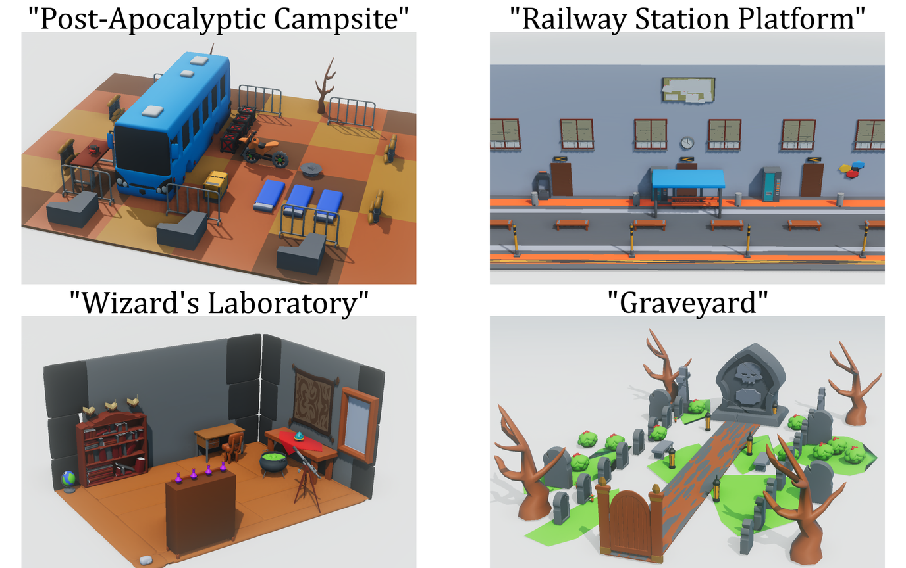

This is a code repository for the paper [Procedural Scene Programs for Open-Universe Scene Generation: LLM-Free Error Correction via Program Search](https://arxiv.org/abs/2510.16147) by Maxim Gumin, Do Heon Han, Seung Jean Yoo, Aditya Ganeshan, R. Kenny Jones, Kailiang Fu, Rio Aguina-Kang, Stewart Morris and Daniel Ritchie, presented at SIGGRAPH Asia 2025.

**Problem**: LLMs have weak spatial reasoning skills, and often make mistakes in numeric parameters. Naive error correction (i.e. gradient descent in object space) doesn't work.

<p align="center"></p>

Solution:
1. Represent scenes programmatically!
2. Correct errors in program space!

<p align="center"></p>


## Abstract
Synthesizing 3D scenes from open-vocabulary text descriptions is a challenging, important, and recently-popular application. One of its critical subproblems is layout generation: given a set of objects, lay them out to produce a scene matching the input description. Nearly all recent work adopts a declarative paradigm for this problem: using an LLM to generate a specification of constraints between objects, then solving those constraints to produce the final layout. In contrast, we explore an alternative imperative paradigm, in which an LLM iteratively places objects, with each object's position and orientation computed as a function of previously-placed objects. The imperative approach allows for a simpler scene specification language while also handling a wider variety and larger complexity of scenes. We further improve the robustness of our imperative scheme by developing an error correction mechanism that iteratively improves the scene's validity while staying as close as possible to the original layout generated by the LLM. In forced-choice perceptual studies, participants preferred layouts generated by our imperative approach 82% and 94% of the time when compared against two declarative layout generation methods. We also present a simple, automated evaluation metric for 3D scene layout generation that aligns well with human preferences.


## Resources
[Benchmark](benchmark.xml) of 70 scene prompts.

Get the autoeval code and the perceptual studies code for this project [here](https://github.com/Brian-han77/percep_study_and_autoeval).

Take a perceptual study yourself: [ImperativeScene-vs-DeclarativeScene](https://brian-han77.github.io/hover_function_perceptual_study/), [ImperativeScene-vs-Holodeck](https://brian-han77.github.io/hover_function_perceptual_study_ver2/), [ImperativeScene-vs-NoErrorCorrection](https://brian-han77.github.io/hover_function_perceptual_study_ver4/), [NoErrorCorrection-vs-DeclarativeScene](https://brian-han77.github.io/hover_function_perceptual_study_ver3/).


## How to run
Get [SceneVisualizer](https://github.com/mxgmn/SceneVisualizer/releases), and paste its `bin` folder into the root folder of this project. Then
```
python main.py
```
Edit [Settings.py](optimizer/Settings.py) to select a particular task.

To synthesize new scenes, insert your LLM API keys into [keys.py](optimizer/keys.py).


## Related projects
[Imperative vs. Declarative Programming Paradigms for Open-Universe Scene Generation](https://arxiv.org/abs/2504.05482).

[Open-Universe Indoor Scene Generation using LLM Program Synthesis and Uncurated Object Databases](https://arxiv.org/abs/2403.09675).

[DeclarativeScene](https://github.com/mxgmn/DeclarativeScene).

<p align="center">



</p>
