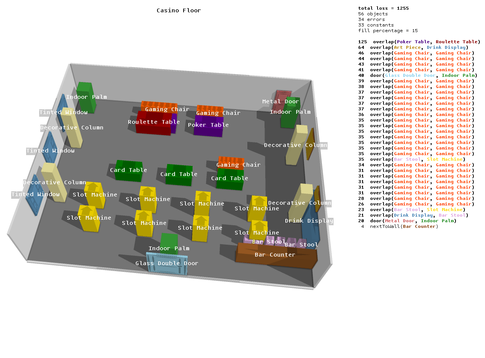

This is a code repository for the paper "[Procedural Scene Programs for Open-Universe Scene Generation: LLM-Free Error Correction via Program Search](https://arxiv.org/abs/2510.16147)".

Problem: LLMs have weak spatial reasoning skills, and often make mistakes in numeric parameters. Naive error correction (i.e. gradient descent in object space) doesn't work.

Solution:
1. Represent scenes programmatically!
2. Correct errors in the program space!

<p align="center"></p>

## How to run
Get SceneVisualizer ...

Put the contents of the ... folder into ... folder.

```
python main.py
```

## Related projects
Get the autoeval code and the perceptual studies code for this project [here](https://github.com/Brian-han77/percep_study_and_autoeval).
